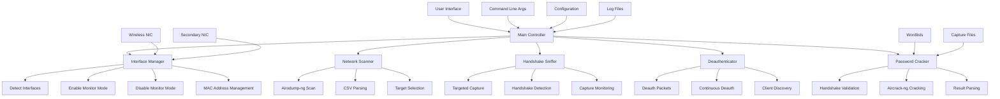

```mermaid
graph TD
    A[Main Controller] --> B[Interface Manager]
    A --> C[Network Scanner]
    A --> D[Handshake Sniffer]
    A --> E[Deauthenticator]
    A --> F[Password Cracker]
    
    B --> B1[Detect Interfaces]
    B --> B2[Enable Monitor Mode]
    B --> B3[Disable Monitor Mode]
    B --> B4[MAC Address Management]
    
    C --> C1[Airodump-ng Scan]
    C --> C2[CSV Parsing]
    C --> C3[Target Selection]
    
    D --> D1[Targeted Capture]
    D --> D2[Handshake Detection]
    D --> D3[Capture Monitoring]
    
    E --> E1[Deauth Packets]
    E --> E2[Continuous Deauth]
    E --> E3[Client Discovery]
    
    F --> F1[Handshake Validation]
    F --> F2[Aircrack-ng Cracking]
    F --> F3[Result Parsing]
    
    G[User Interface] --> A
    H[Command Line Args] --> A
    I[Configuration] --> A
    
    J[Wireless NIC] --> B
    K[Secondary NIC] --> B
    L[Wordlists] --> F
    M[Capture Files] --> F
    N[Log Files] --> A
```